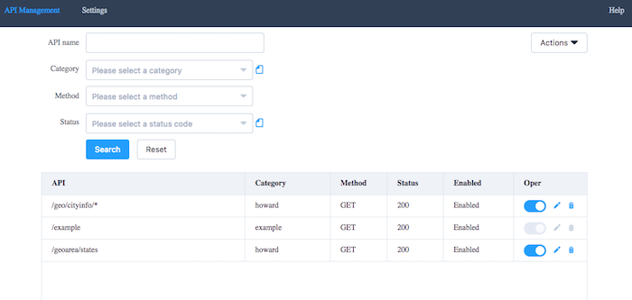

naive-mock
==========================

[![NPM version][npm-image]][npm-url]
![][david-url]
![][dt-url]
![][license-url]

A lightweight mock system with web configuration interface.



## Usage ##

```bash
# install naive-mock 
npm install --global naive-mock
```

## Options ##

- `port` - Specify port number you want `naive-mock` run for
- `dataDir` - Specify where to put mock data, settings.json. For example: `./data`
- `logDir` - Specify where to put error log. Useful when you have error using `naive-mock`, you can send error log to me. No log recorded by default
- `help` - Print help menu with the list of arguments
- `version` - Print what version it is

## Give a try ##

```bash
mock --port 8080
```

>The mock system will be launched at port `8080`. Visit it with: [http://127.0.0.1:8080](http://127.0.0.1:8080). Data & settings will be stored at `${CWD}/data/`.


## Want play with source code? ##


```bash
#clone this repo
git clone https://github.com/leftstick/naive-mock.git

#install dependencies
npm install

#start portal at 3000 portal
npm start
```

>Now you can visit portal through: [http://localhost:3000](http://localhost:3000)


## LICENSE ##

[GPL v3 License](https://raw.githubusercontent.com/leftstick/naive-mock/master/LICENSE)


[npm-url]: https://npmjs.org/package/naive-mock
[npm-image]: https://badge.fury.io/js/naive-mock.png
[david-url]: https://david-dm.org/leftstick/naive-mock.png
[dt-url]:https://img.shields.io/npm/dt/naive-mock.svg
[license-url]:https://img.shields.io/npm/l/naive-mock.svg
